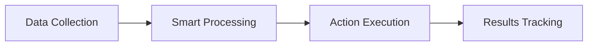

# Portfolio Content Generation Template

## Project Information Structure

### 1. Hero Section
- **Title**: [Project Name]
- **Description**: [2-3 sentence overview]
- **Background Image**: [project-name]-bg.jpg
- **Key Stats**:
  - Time Saved: [X]%
  - Accuracy: [X]%
  - Efficiency: [X]x

### 2. Core Components
- **Component 1**: [Title]
  - Description: [2-3 sentences]
  - Icon: [Font Awesome icon]
- **Component 2**: [Title]
  - Description: [2-3 sentences]
  - Icon: [Font Awesome icon]
- **Component 3**: [Title]
  - Description: [2-3 sentences]
  - Icon: [Font Awesome icon]

### 3. Process Steps
1. **Discovery & Analysis**
   - Description: [2-3 sentences about initial phase]
   - Icon: 🔍

2. **Workflow Design**
   - Description: [2-3 sentences about design phase]
   - Icon: 📐

3. **Development & Integration**
   - Description: [2-3 sentences about implementation]
   - Icon: ⚡

4. **Testing & Optimization**
   - Description: [2-3 sentences about testing]
   - Icon: ✅

### 4. Workflow Diagram


### 5. Project Highlights
- **Highlight 1**: [Title]
  - Description: [2-3 sentences]
  - Icon: [Font Awesome icon]
- **Highlight 2**: [Title]
  - Description: [2-3 sentences]
  - Icon: [Font Awesome icon]
- **Highlight 3**: [Title]
  - Description: [2-3 sentences]
  - Icon: [Font Awesome icon]

### 6. Related Projects
- [Project 1 Name]
  - Description: [1-2 sentences]
  - Image: [project1]-thumb.jpg
- [Project 2 Name]
  - Description: [1-2 sentences]
  - Image: [project2]-thumb.jpg

## File Structure
```
projekt-ai-website/
├── [project-name].html
├── assets/
│   ├── img/
│   │   ├── uploads/
│   │   │   ├── [project-name]-bg.jpg
│   │   │   ├── [project-name]-workflow.png
│   │   │   └── [project-name]-result.png
│   │   └── projects/
│   │       └── [project-name]-thumb.jpg
```

## Generation Process
1. Fill out the template above with project-specific information
2. Generate workflow diagram using Mermaid.js
3. Create necessary images and assets
4. Update the HTML template with the content
5. Add project card to main portfolio page
6. Test all links and responsive design
7. Deploy changes

## Quality Checklist
- [ ] All images are optimized and responsive
- [ ] Workflow diagram is clear and professional
- [ ] Content is consistent with brand voice
- [ ] All links work correctly
- [ ] Mobile responsiveness is tested
- [ ] SEO meta tags are properly set
- [ ] Performance is optimized 